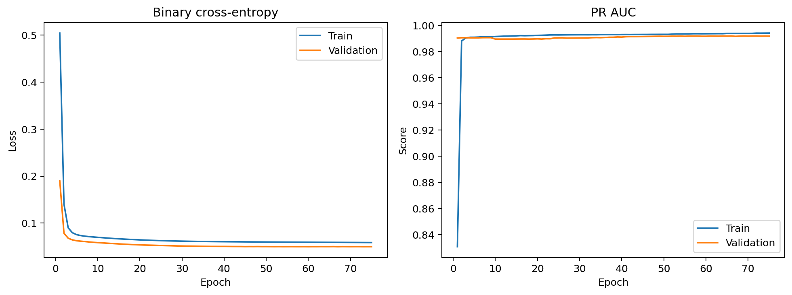
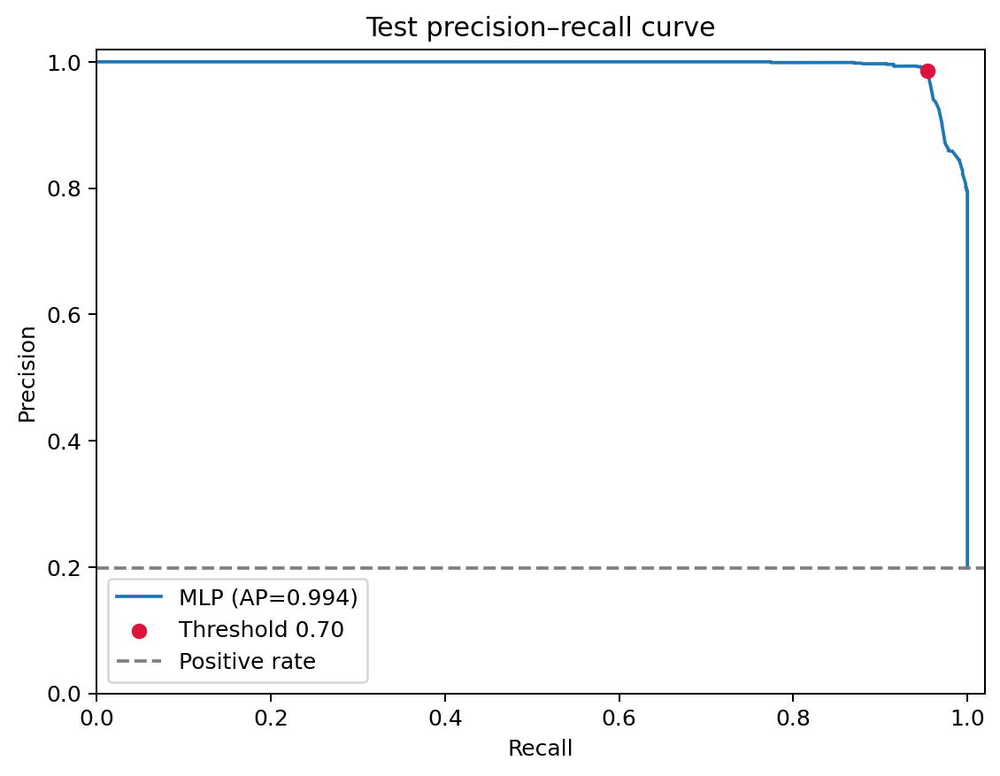
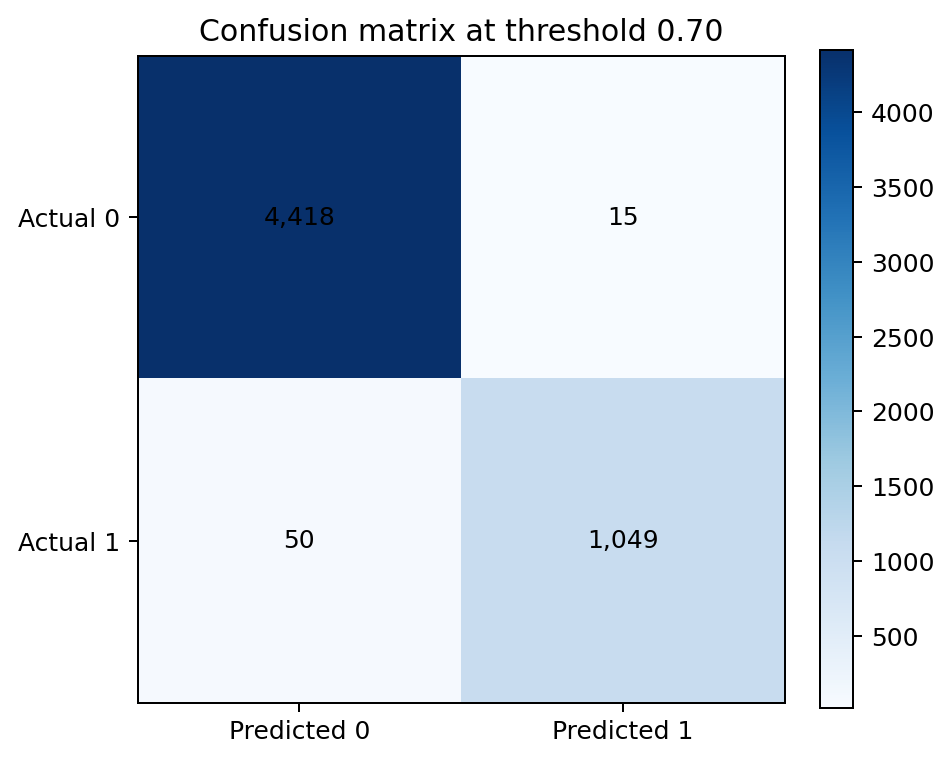
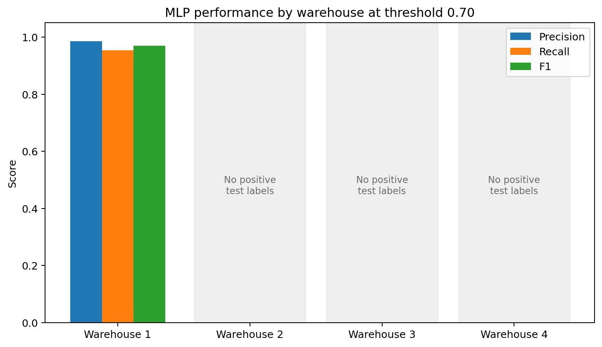
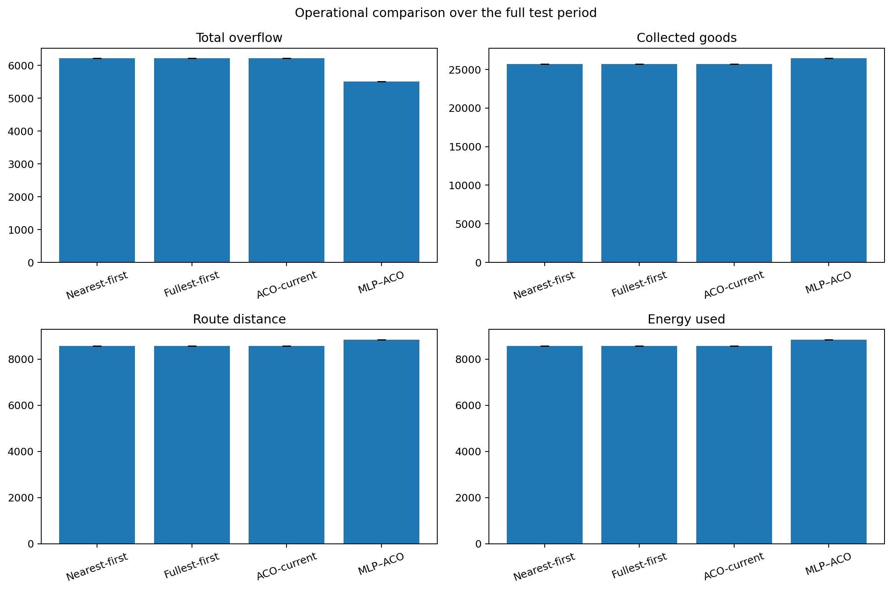
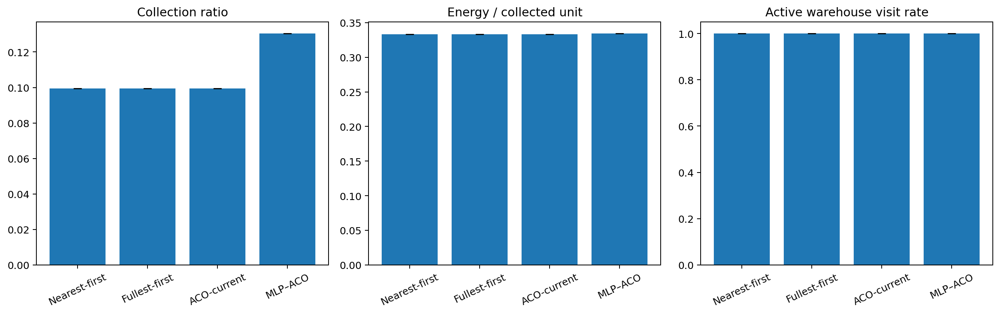
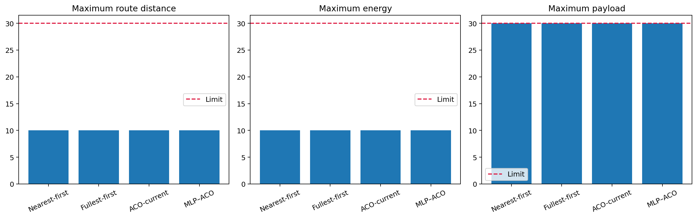
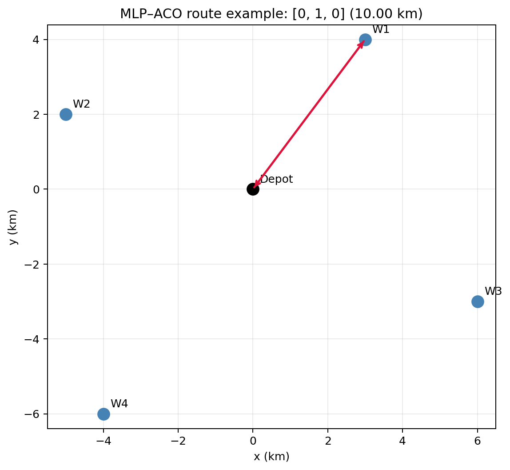

# Kết quả MLP–ACO một drone

## Phạm vi chạy

- MLP được đánh giá trên 5.532 samples thuộc chronological test split.
- Routing được chạy trên toàn bộ 1.387 interval từ ngày 75 trở đi.
- Nearest-first và fullest-first chạy một lần vì deterministic.
- ACO-current và MLP–ACO chạy với 10 seeds, tổng cộng 22 operational runs.
- Prediction threshold cố định: `0.70`.

## Kết quả MLP tại threshold 0.70

| Metric | Kết quả |
|---|---:|
| PR-AUC | 0.9938 |
| ROC-AUC | 0.9984 |
| Precision | 0.9859 |
| Recall | 0.9545 |
| F1 | 0.9699 |
| Accuracy | 0.9883 |
| Balanced accuracy | 0.9756 |
| True negative | 4.418 |
| False positive | 15 |
| False negative | 50 |
| True positive | 1.049 |

So với current-fill rule ở ngưỡng 80%, MLP tăng F1 từ `0.8769` lên `0.9699` và recall từ `0.7807` lên `0.9545`.

## Kết quả vận hành

| Policy | Overflow | Collected | Distance | Energy | Sorties |
|---|---:|---:|---:|---:|---:|
| Nearest-first | 6.219 | 25.710 | 8.570 | 8.570 | 857 |
| Fullest-first | 6.219 | 25.710 | 8.570 | 8.570 | 857 |
| ACO-current | 6.219 | 25.710 | 8.570 | 8.570 | 857 |
| MLP–ACO | **5.511** | **26.448** | 8.840 | 8.840 | 884 |

So với ACO-current, MLP–ACO:

- giảm overflow `708` units, tương đương `11.38%`;
- thu gom thêm `738` units;
- bay thêm `270 km` trên toàn test period;
- không có kho dưới threshold 0.70 xuất hiện trong route.

## Constraint

Tất cả 22 run đều thỏa constraint:

| Constraint | Giới hạn | Lớn nhất quan sát |
|---|---:|---:|
| Route distance mỗi interval | 30 km | 10 km |
| Energy mỗi interval | 30 | 10 |
| Payload mỗi interval | 30 | 30 |
| Constraint violations | 0 | 0 |
| Kho dưới threshold được ghé | 0 | 0 |

## Giới hạn quan trọng của kết quả

Trong test set, chỉ Warehouse 1 có positive congestion labels. Warehouse 2–4 không có positive support, vì vậy không thể tuyên bố model tổng quát tốt cho ba kho này.

Ngoài ra, số kho active lớn nhất trong bất kỳ interval nào là `1`; không có interval nào có nhiều kho active cùng lúc. Do đó 10 ACO seeds cho kết quả vận hành giống nhau và dữ liệu hiện tại chưa kiểm chứng khả năng ACO tối ưu thứ tự route qua nhiều kho.

## Bảng chi tiết

- `../model_outputs_single_drone/classification_metrics_at_070.csv`
- `../model_outputs_single_drone/per_warehouse_classification_metrics.csv`
- `../model_outputs_single_drone/prediction_baseline_comparison.csv`
- `tables/key_results.csv`
- `tables/constraint_summary.csv`
- `tables/operational_metrics_by_run.csv`
- `tables/operational_summary.csv`
